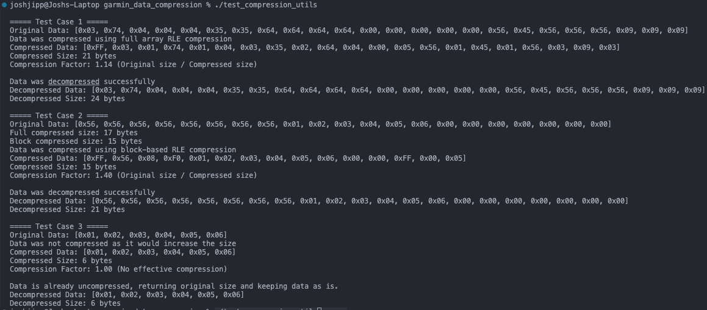

## Design Decisions
I implemented `Run-Length Encoding (RLE)` for data compression using `C`, despite it not being the language I am most comfortable with. I chose C because it is widely used in embedded systems and is a key language at Garmin. To enhance the compression, I developed two variations of RLE: one for `block-based` compression and one for compressing the `entire array`. The block-based method is particularly effective when there are sections of repeating bytes as well as sections with diverse byte values. This method allows for partial compression of the data, optimizing performance by compressing chunks rather than taking an all-or-nothing approach, which is typical of array-wide compression. I also introduced two flags to signify whether the data is compressed or not: `0xFF` represents a compressed block or array, while `0xF0` represents uncompressed blocks. These values were chosen because they fall outside the standard ASCII range and can easily differentiate between compressed and uncompressed data. If no flags are present, we know the data is uncompressed; if the flags are found, it indicates that the data has been compressed.

## Cloning and Running the Code
1. Clone the repository to your computer. Run the following command in your desired directory:
```
https://github.com/joshuajipp/garmin_data_compression.git
```
2. Change directory to the root of the project:
```
cd garmin_data_compression
```
3. Compile the program:
```
gcc -o test_compression_utils test_compression_utils.c compression_utils/compression.c compression_utils/decompression.c -Icompression_utils
```
4. Execute the program:
```
./test_compression_utils
```
5. View the output of the program and feel free to change input array data in `test_compression_utils.c`
